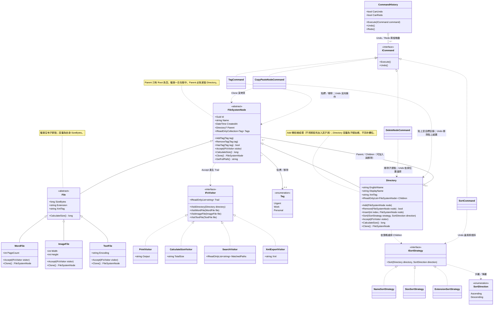

# 目標領域類別圖

本圖為 **SA 先行的目標模型**，含功能四（排序、刪除／複製貼上、標籤、Undo／Redo）。即使程式尚未實作，功能四仍留在目標模型中，實作時對齊此圖。

**Seed 註記（不寫進類別名稱）**  
Archive 目錄的名稱為 `2025備份`、英文名為 `Archive_2025`。樹狀顯示為 `2025備份 (Archive_2025)`；XML 目錄標簽名例外為 `Archive_2025`，不是兩者串接。此為 Seed 的顯示規則，不影響類別結構。

**容量註記**：檔案以 bytes 儲存（1 KB = 1024）。對外「計算總容量」的結果為單一 `TotalSize`（B／KB／MB 顯示字串），不拆成 `TotalBytes` 與 `DisplaySize`。目錄不另存容量欄位。

## 關係說明

下表逐條對應圖中的關係線，語意與圖一致。

| 圖中關係 | 語意 |
|---|---|
| `FileSystemNode <\|-- Directory`、`FileSystemNode <\|-- File` | Composite：目錄與檔案是同一種節點，客戶端一致對待 |
| `File <\|-- WordFile／ImageFile／TextFile` | 檔案子型別各自帶頁數、解析度、編碼 |
| `Directory "0..1" o-- "0..*" FileSystemNode` | **單一聚合關係**：Parent 端 `0..1`（僅 Root 為空），與節點屬性 `Directory? Parent` 同一套可空語意；Children 端 `0..*`。檔案入樹後必屬目錄見 `FileSystemNode` 註記，不另拉一條 `File → Directory` 基數 1 的關聯 |
| 同上關係的「可加入與移除」 | 目錄提供加入、指定位置插入與 **移除** 子節點；刪除命令與其 Undo 依賴移除與依原位置還原 |
| `Directory` 註記 | 加入時必須拒絕成環；目錄容量為子樹加總，不儲存欄位 |
| `File` 註記 | 檔案沒有 Children，是 Composite 的葉節點 |
| `FileSystemNode "0..*" --> "0..3" Tag` | 標籤僅 Urgent／Work／Personal，可多選；上限 3 即為可多選但不重複 |
| `FileSystemNode` 的 `AddTag`／`RemoveTag`／`HasTag` | 貼標與移除是**節點上可呼叫的領域操作**，不是只有列舉與唯讀集合 |
| `FileSystemNode ..> IFsVisitor` | 節點 Accept 訪問者；走訪過程逐步累積 Trail |
| `IFsVisitor <\|.. Print／CalculateSize／Search／XmlExport` | 功能一～三所需的四種 Visitor；計算容量的對外結果為 `TotalSize`，不是 `TotalBytes`＋`DisplaySize` |
| `ISortStrategy <\|.. Name／Size／Extension` 與 `..> SortDirection` | 功能四排序：依名稱、大小、副檔名，且支援升冪與降冪 |
| `Directory ..> ISortStrategy` | 排序作用在目錄的 Children 順序上 |
| `FileSystemNode.Clone()` | Prototype：深拷貝子樹並產生新 Id，供複製貼上使用 |
| `ICommand <\|.. Delete／CopyPaste／Sort／Tag` | 功能四操作皆封裝為命令，具備 Execute 與 Undo |
| `CommandHistory o-- "0..*" ICommand` | 命令歷程以 Undo／Redo 兩個堆疊保存已執行命令 |
| `DeleteNodeCommand ..> Directory` | 刪除即自父目錄移除；Undo 依原索引插回 |
| `CopyPasteNodeCommand ..> FileSystemNode／Directory` | 以 Clone 產生副本並貼入目標目錄；Undo 移除該副本 |
| `SortCommand ..> ISortStrategy` | 排序可復原：Undo 還原排序前的子節點順序 |
| `TagCommand ..> FileSystemNode` | 貼標／移除標籤可復原 |
