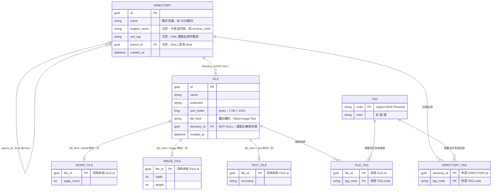

# 目標 ER 模型

本圖為作業要求的 **Schema 設計文件**，與記憶體物件樹並存。執行期不落地資料庫；`SampleTreeFactory` 建立的 Composite 對應此結構。

**不建表的部分：** 列印／計算容量／搜尋／XML 匯出等訪問者、排序策略、命令與命令歷程、原型複製，皆為行為與操作，不建模成資料表。

**Seed 註記：** Archive 目錄的 `name` 為 `2025備份`、`english_name` 為 `Archive_2025`，XML 標簽名例外存於 `xml_tag = Archive_2025`（不是兩者串接）。

**容量註記：** `FILE.size_bytes` 一律存 bytes，1 KB = 1024 bytes。目錄**不儲存**總容量。走訪計算的對外結果為 `TotalSize`（B／KB／MB 顯示），Schema 不另建 `total_bytes` 或 `display_size` 欄位。

## Schema 說明

| 規則 | 從 Schema 如何看出 |
|---|---|
| 目錄可無限層巢狀，Root 的父目錄為空 | `DIRECTORY.parent_id` 自參照，關係為 `\|o--o{`：父端 0..1、子端 0..*，`parent_id IS NULL` 即為 Root |
| 檔案必屬目錄 | `DIRECTORY \|\|--o{ FILE`，`FILE.directory_id` 標為 `NOT NULL` 外鍵，不存在沒有目錄的檔案 |
| 目錄不儲存總容量 | `DIRECTORY` 沒有容量欄位；只有 `FILE.size_bytes`。對外總容量是走訪後的 `TotalSize`，不是表上的 `TotalBytes`／`DisplaySize` |
| 一個檔案恰好一種子型（互斥） | `FILE.file_kind` 為鑑別欄位；三張子型表各以 `file_id` 當主鍵，故對同一檔案至多一列，再由 `file_kind` 決定存在於哪一張，合起來即「恰一種」 |
| Word／Image／Text 各自屬性 | `page_count`／`width` `height`／`encoding` 只出現在對應子型表，不污染 `FILE` |
| 標籤與目錄、檔案皆多對多 | 兩張關聯表 `DIRECTORY_TAG`、`FILE_TAG`，各自複合主鍵 `(節點, tag_code)`；一個節點可同時掛 Urgent、Work、Personal |
| 參照完整性 | 標籤關聯**不使用多型外鍵**：`DIRECTORY_TAG.directory_id`、`FILE_TAG.file_id`、兩表的 `tag_code` 都是明確可建立的外鍵，複合主鍵同時避免重複貼同一標籤 |
| 標籤只有三種 | `TAG.code` 為主鍵且限定 `Urgent`／`Work`／`Personal`，顏色對應紅／藍／綠 |
| 樹不可有環 | Schema 只保證父子關聯；防環由領域加入子節點時的不變量負責 |

### 對應的完整性約束

以關聯式資料庫落地時，需搭配下列約束（Mermaid 圖形無法直接畫出）：

- `FILE.file_kind` 限定為 `Word`／`Image`／`Text`
- 子型表存在性與 `file_kind` 一致：`file_kind = Word` 時 `WORD_FILE` 必有對應列，且 `IMAGE_FILE`／`TEXT_FILE` 不得有列（Image、Text 同理）
- `DIRECTORY.parent_id` 參照 `DIRECTORY.id`；Root 僅一列且 `parent_id IS NULL`
- 同一目錄下名稱唯一（對應樹狀顯示不重複）

排序、刪除、複製貼上、Undo／Redo 皆為對這些資料列的操作，狀態變化反映在 `parent_id`／`directory_id` 與標籤關聯表上，因此不需要額外的行為資料表。
